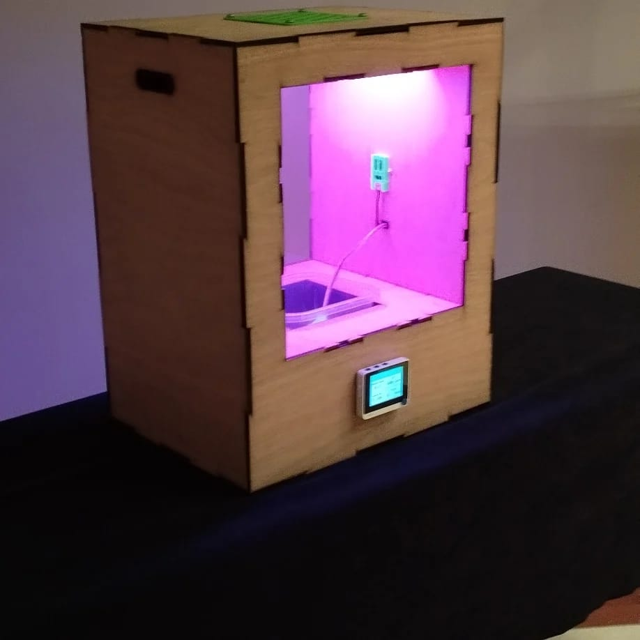
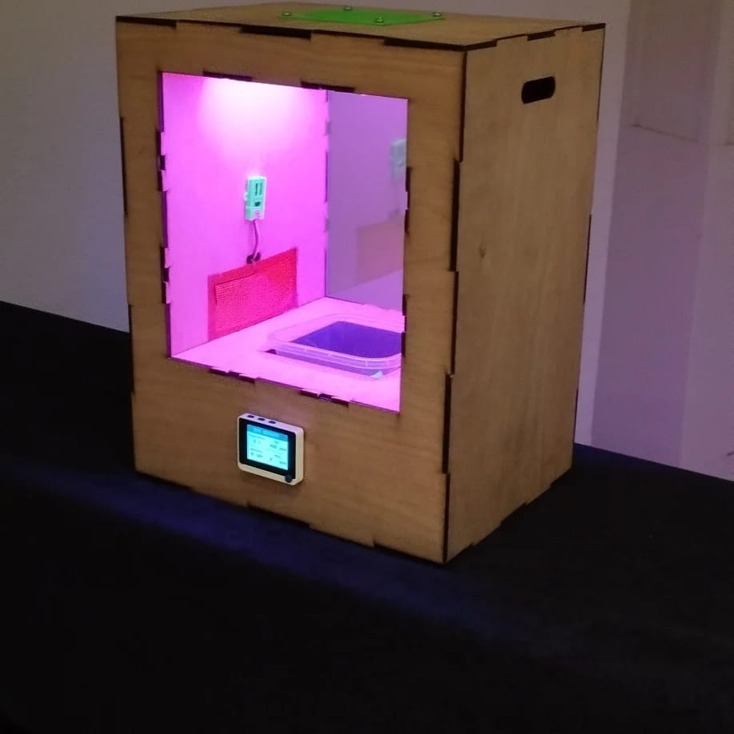

# POWAR-WIO
POWAR Running on WIO terminal

Initial documentation for RMIT collaboration:

## POWAR CLIMATE SIMULATOR

**Hackster Documentation** (outdated)

https://www.hackster.io/pabzul/powar-v2-0-wio-terminal-73f2b9

### Introduction:

  

POWAR is a climate simulator in the form of a box that allows users to grow food under future predicted weather scenarios from different cities around the world. It combines the power of technology and education to provide a hands-on experience for students and smallholder farmers alike. By replicating the weather conditions of different regions, POWAR enables users to conduct experiments and observe how crops respond to specific climate conditions. This innovative approach fosters a deeper understanding of the effects of climate change on food production and empowers individuals to make informed decisions. The data generated from these experiments contributes to a global knowledge database, enhancing our understanding of how crops will perform under various climate scenarios. With POWAR, students can learn about climate change, food security, and sustainable agriculture, while smallholder farmers gain valuable insights to enhance their resilience and adaptability. By bridging the gap between education and practical application, POWAR empowers individuals to tackle the challenges of climate change and work towards a more sustainable future.

### Technologies Involved:

**Seeed Studio WIO Terminal**

https://www.seeedstudio.com/Wio-Terminal-p-4509.html

https://wiki.seeedstudio.com/Wio-Terminal-Getting-Started/

https://www.seeedstudio.com/wio-terminal

**Groove - I2C 4 channel Relay**

https://www.seeedstudio.com/Grove-4-Channel-SPDT-Relay-p-3119.html

https://wiki.seeedstudio.com/Grove-4-Channel_SPDT_Relay/

**Groove - Mosfet**

https://www.seeedstudio.com/Grove-MOSFET.html

https://wiki.seeedstudio.com/Grove-MOSFET/

**Seeed Studio SHT-40 (Moisture and Humidity Sensor)**

https://www.seeedstudio.com/Grove-Temp-Humi-Sensor-SHT40-p-5384.html

https://wiki.seeedstudio.com/Grove-SHT4x/

https://wiki.seeedstudio.com/K1100-Temp-Humi-Sensor-Grove-LoRa-E5/

**Grove - VOC and eCO2 Gas Sensor (SGP30)**

https://www.seeedstudio.com/Grove-VOC-and-eCO2-Gas-Sensor-for-Arduino-SGP30.html

https://wiki.seeedstudio.com/Grove-VOC_and_eCO2_Gas_Sensor-SGP30/

https://wiki.seeedstudio.com/K1100-VOC-and-eCO2-Gas-Sensor-Grove-LoRa-E5/

**Grove - Soil Moisture Sensor**

https://www.seeedstudio.com/Grove-Moisture-Sensor.html

https://wiki.seeedstudio.com/Grove-Moisture_Sensor/

**Arduino IDE (for programming the microcontroller)**

**Node-Red (for the Interface)**

**MQTT (protocol)**

## POWAR IoT Board:

https://www.hackster.io/pabzul/powar-wio-terminal-iot-board-22e1d7

The Power board is a custom designed development kit for building smart homes, connected devices with IoT capabilities using WIO Terminal. An IoT board designed to expand the connectivity of the WIO terminal adding 7 I2C ports, 5 PWM, 5 GPIOS, and 12V & 5V power management.

